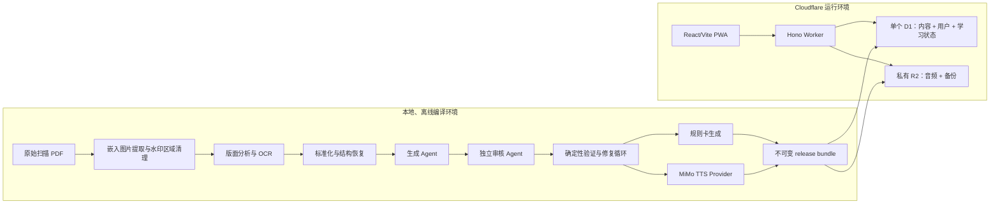

# LexiLoop 产品与技术设计

- 状态：已完成逐节确认，待规格独立审查
- 日期：2026-09-10
- 首发内容：《2024 恋练有词考研英语真题词汇 6500 分层串记》本地 PDF
- 部署目标：Cloudflare Workers、单个 D1 数据库、私有 R2
- 核心约束：AI 只用于离线内容编译；线上学习路径不调用 AI

## 1. 摘要

LexiLoop 是面向中国考研英语阅读场景的“数字教材 + 真题语境解释 + 间隔复习”私有 Web 应用。它不是把教材机械转换成牌组，而是保留教材的 Unit、分层、词序、词义、短语和真题例句结构，在此基础上生成可追溯的解释与规则化学习卡，再用 FSRS 安排已经学过的卡片。

系统由两个相互校验的部分组成：

1. **Content Compiler（内容编译器）**：在本地读取原始扫描 PDF，生成去水印页图供 OCR 与 Agent 校验，完成结构化、Agent 生成、独立 Agent 审核、确定性验证、卡片生成与 MiMo TTS 音频合成，最后产出一个不可变的 release bundle。
2. **Web App（学习应用）**：React PWA 通过 Hono Worker 访问单个 D1 中的教材与学习数据，并通过 Worker 读取私有 R2 音频。Worker 是鉴权、FSRS 状态变更和版本选择的唯一权威。

“编译”在本文中指：把不适合直接供程序使用的 PDF，通过可恢复流水线转换成经过自动审核、能够安全导入 D1/R2 的版本化数据包。它不是前端打包，也不会在用户学习时运行。

## 2. 产品目标与非目标

### 2.1 V1 目标

- 按原书 Unit、词汇分层和顺序学习，可选择起始 Unit。
- 每个词条展示原书信息、真题语境和结构化解释。
- 学习新词时先记录熟悉度，完成小组学习后进行快速回忆，再进入正式 FSRS 评分。
- 支持四类规则卡：单词释义、语境词义、短语、词义辨析。
- 单词和每条真题例句均有预生成音频。
- 提供搜索、词条详情、学习统计、错难词视图和内容版本升级。
- 支持若干预置账户；账户之间学习记录完全隔离。
- PDF 处理、内容生成、内容审核、音频校验与发布门禁全部自动化，不设置人工审核步骤。

### 2.2 非目标

- 公开注册、OAuth、忘记密码、自助账号管理。
- 社区、排行榜、分享牌组、协作编辑。
- 运行时 AI 问答、AI 搜索、向量数据库。
- 原生 iOS/Android 客户端。
- 人工内容审核后台。
- 生成、保存为发布物或分发“去水印 PDF”。
- V1 同时上线多本教材；数据模型需支持后续多书与多版本。

### 2.3 成功标准

- 目标 Unit 全部通过自动发布门禁，水印文本零进入教材字段。
- 原书字段均可追溯到 PDF 哈希、页码和原图坐标。
- 每个必需音频资源存在且通过确定性音频检查。
- 多个预置账户可独立完成“新词学习 → 快速回忆 → FSRS 复习 → 撤销评分”。
- 内容升级不丢失已有 FSRS 状态，且能回滚至上一版本。
- 移动端主流程、桌面端键盘流程、备份恢复演练全部通过。

## 3. 已确认的关键决策

| 主题 | 决策 |
|---|---|
| 数据库 | 只使用一个 D1；教材、账户、学习状态和版本元数据分表存放 |
| 音频 | 私有 R2；编译期预生成；运行时不调用 TTS |
| AI 边界 | 仅在 Content Compiler 使用；线上应用没有 LLM 依赖 |
| 审核 | 生成 Agent、独立审核 Agent、确定性验证器、修复 Agent；不人工审核 |
| 失败策略 | 最多修复 3 轮；仍失败的 Unit 标记 `BLOCKED`，不得进入 release |
| 内容发布 | 新 release 先暂存并校验，再原子切换；保留上一版本供回滚 |
| 学习调度 | 新词按教材顺序；只有已经学过的卡进入 FSRS 调度 |
| 账户 | 预置多个本地账户，无注册与 OAuth |
| 搜索 | D1 普通索引 + FTS5；V1 不使用向量搜索 |
| PDF 水印 | 仅生成私有去水印页图供 OCR/QA；不输出去水印 PDF |
| 音频审核 | 不使用 ASR，不做音频回读；只做确定性文件与清单检查 |

## 4. 系统上下文与总体架构



### 4.1 边界原则

- 浏览器不直接访问 D1 或私有 R2，所有请求均经过 Worker。
- 客户端不计算最终 FSRS 状态，也不能指定操作所属的 `user_id`。
- Content Compiler 不直接修改当前线上 release；它只产出版本包，发布器负责暂存、验证和激活。
- 教材源字段与 AI 生成字段物理分离，Agent 不能覆盖源字段。
- 线上版本由 `app_meta.active_release_id` 唯一决定。

## 5. Content Compiler 详细设计

### 5.1 输入与产物

输入：

- 本地原始 PDF。
- 版本化的水印区域规则、OCR 配置、内容 Schema、Agent Prompt、卡片规则和 TTS 配置。
- 从未提交到 Git 的 MiMo API Key。

最终产物：

- `manifest.json`：release 标识、源 PDF SHA-256、配置版本、模型/声音配置、各文件哈希、统计值和门禁结果。
- 分批 D1 导入 SQL 或等价的结构化导入文件。
- 以内容哈希寻址的音频对象及上传清单。
- 不含大段教材原文的脱敏 QA 报告。
- 回滚元数据和上一兼容版本要求。

### 5.2 阶段状态机

每次编译有一个 `compile_run_id`。每个阶段记录 `PENDING | RUNNING | PASSED | FAILED | BLOCKED`、输入哈希、输出哈希、开始/结束时间、尝试次数和错误码。只有输入哈希或阶段配置变化时才重跑；网络超时与限流采用有界指数退避。

阶段顺序：

1. `SOURCE_FINGERPRINT`
2. `IMAGE_EXTRACT`
3. `WATERMARK_CLEAN`
4. `LAYOUT_OCR`
5. `STRUCTURE_NORMALIZE`
6. `AGENT_ENRICH`
7. `AGENT_REVIEW`
8. `DETERMINISTIC_VALIDATE`
9. `REPAIR_LOOP`
10. `CARD_GENERATE`
11. `TTS_SYNTHESIZE`
12. `AUDIO_VALIDATE`
13. `RELEASE_PACKAGE`

编译可从最后一个输入哈希仍匹配的 `PASSED` 阶段继续，不要求从头开始。

### 5.3 页面图像提取与水印清理

当前 PDF 是约 440 页的纯图像扫描件，每页主要包含一张嵌入图片，没有可复用文本层。因此优先无损提取每页嵌入的 JPEG，而不是先渲染整页，以避免二次压缩。

水印已烧录进页面位图，不能通过删除 PDF 文本对象处理。清理流程为：

1. 把页面坐标归一化到 `[0,1] × [0,1]`，按版式类别配置顶部、底部等候选水印区域。
2. 使用跨页重复纹理、颜色和 OCR 命中共同确认水印 mask，mask 规则带版本号。
3. 只在 mask 内使用背景估计、内容感知修补或裁切；教材正文区域不得扩大处理范围。
4. 原始页图只读保留；清理页图写入 `.lexiloop-private/work/<pdf-hash>/pages-clean/`。
5. 图像 Agent 检查所有异常页，并对普通页按分层抽样检查；确定性校验核对页数、尺寸、顺序、mask 越界和已知水印词命中。
6. 清理页图只供 OCR 与 Agent QA，不重新组装成 PDF，也不作为产品资源分发。

若水印与正文重叠导致清理会损伤正文，该页不能静默通过；它进入 Agent 修复循环。三轮仍无法恢复时，其所属 Unit 为 `BLOCKED`。

### 5.4 版面分析、OCR 与标准化

- 使用 PaddleOCR PP-StructureV3 完成版面区域识别和首轮 OCR；它适合处理复杂文档版面，具体模型版本在 manifest 中锁定。[官方文档](https://paddlepaddle.github.io/PaddleOCR/main/en/version3.x/pipeline_usage/PP-StructureV3.html)
- 保存每个文本块的 `page_number`、归一化 `bbox`、OCR 文本、置信度、版面角色和页图哈希。
- 结构恢复器识别书籍、Unit、词汇层级、词头、音标、词性、释义、短语、例句和注释之间的层次。
- 对连字符换行、跨栏顺序、跨页词条、重复页眉页脚、全半角符号和 OCR 常见混淆进行确定性归一化。
- 原始 OCR 块不可被 Agent 修改；纠正结果作为带原因和证据的新字段保存。

关键字段如果低于置信阈值，必须由视觉 Agent 回看对应 `page_number + bbox`，不能只根据上下文猜测。

### 5.5 内容记录与来源追踪

每个原书实体至少包含：

- 稳定逻辑 key。
- `source_pdf_sha256`、页码、bbox、页图哈希。
- `source_raw_text` 或其私有引用。
- `source_normalized_text`。
- OCR 与结构化置信度。
- `generated_*` 字段及生成模型、Prompt 版本、时间和输入哈希。
- 审核结果、问题码和修复历史。

稳定 key 不含 `release_id`，建议由 `book_key + edition_key + unit_key + entity_type + source_ordinal + normalized_headword` 规范化后生成。只有经过显式 alias 迁移才能把新 key 关联到旧 key，禁止模糊匹配自动继承用户进度。

### 5.6 全 Agent 内容审核

流水线有四个职责隔离的角色：

1. **生成 Agent**：根据原书字段与真题例句生成语境词义、句法拆解、翻译提示、易错点和辨析候选。
2. **独立审核 Agent**：只读取源证据、生成结果和 Schema，不读取生成 Agent 的推理；逐字段给出 `PASS | REPAIR | BLOCK` 和结构化问题码。
3. **确定性验证器**：检查 Schema、枚举、长度、必填项、外键、稳定 key、引用页码、原书字段不可变、禁止词和跨字段一致性。
4. **修复 Agent**：只处理审核器指出的问题，并必须返回逐问题修复映射；不能顺便重写已通过字段。

流程最多三轮：

```text
生成 → 独立审核 → 确定性验证
              ↓ 不通过
          修复 Agent → 重新独立审核 → 重新验证
```

三轮后仍有未解决问题时，整个 Unit 进入 `BLOCKED`。发布可以包含其他全部通过的 Unit，但 manifest 必须明确目标范围；如果发布声明包含某 Unit，则该 Unit 必须 `PASSED`，不得部分发布。

### 5.7 规则卡生成

卡片不由 Agent 自由编写，而是由通过审核的结构化内容按固定规则生成：

| 卡类型 | 正面 | 背面 | 生成条件 |
|---|---|---|---|
| `WORD_MEANING` | 词头、可选音标/音频 | 核心释义与词性 | 每个可学习 sense |
| `CONTEXT_MEANING` | 真题句中目标词挖空 | 语境义、原句与解释 | 有合格例句和语境义 |
| `PHRASE` | 短语或短语挖空 | 释义、搭配和来源句 | 短语通过审核 |
| `SENSE_DISCRIMINATION` | 相近义项选择/辨析提示 | 区分依据和例句 | 审核确认存在易混义项 |

每张卡使用稳定 `content_card_key`。模板版本变化不应自动创建新卡；语义目标变化才通过新 key 或显式 alias 处理。

### 5.8 TTS 合成与音频校验

- V1 为每个词头和每条真题例句预生成音频。
- 默认 Provider 为 Xiaomi MiMo `mimo-v2.5-tts`，使用预置英语音色；Provider 接口允许后续替换。官方文档当前标注该服务限时免费，但发布前仍需重新确认条款。[MiMo TTS 文档](https://mimo.mi.com/docs/zh-CN/quick-start/usage-guide/audio/speech-synthesis-v2.5)
- API Key 仅从本地环境读取，不写入日志、manifest 或仓库。
- 缓存 key 由 `provider + model + voice + normalized_text + synthesis_config_version` 的哈希组成。
- R2 object key 采用内容寻址，例如 `audio/<hash-prefix>/<hash>.wav`；不同 release 可复用相同对象。
- 合成前输出字符量、预计调用数和缓存命中率；失败采用有界重试。

音频门禁只做确定性检查，不接入 ASR、不做音频回读：

- 清单中的必需资源 100% 存在。
- 文件可被目标解码器解码，采样率、声道、编码和容器符合约定。
- 时长落在按文本长度计算的宽容区间内。
- 非空音频、非全静音，头尾静音不超阈值。
- 峰值、削波比例和文件大小不异常。
- 音频元数据中的 `text_hash` 与内容记录匹配。

这些检查不能证明发音语义绝对正确，因此这是已接受的 V1 风险。Provider、模型、音色或合成参数变化时必须产生新的缓存 key，并重新走音频门禁。

### 5.9 Release bundle

一个 release bundle 是不可变目录，至少包含：

```text
manifest.json
d1/
  001-content.sql
  002-cards.sql
  003-search.sql
r2/
  audio-manifest.jsonl
qa/
  unit-status.json
  validation-summary.json
rollback.json
```

真实 bundle 位于 `.lexiloop-private/releases/` 或 `artifacts/releases/`，均被 Git 忽略。manifest 对每个文件保存 SHA-256，发布器在上传/导入前后复核。

## 6. Web App 与运行时设计

### 6.1 技术栈

- 前端：React、TypeScript、Vite、Tailwind CSS、PWA Service Worker。
- API：Hono on Cloudflare Workers。
- 数据：单个 Cloudflare D1，多张逻辑分组表；音频与备份使用私有 R2。
- 调度：`ts-fsrs`，具体版本锁定并用官方固定案例验证。[项目仓库](https://github.com/open-spaced-repetition/ts-fsrs)
- Schema：Zod 作为编译输入、API 请求/响应和 Agent 结构化输出的共享契约。
- 数据访问：Drizzle schema 用于类型和迁移；关键写路径使用显式 prepared statements 与 D1 `batch()`。
- 测试：Vitest、Pytest、Playwright。

### 6.2 单个 D1 的表分组

所有版本化内容表都带 `release_id`。内容表主键采用 `(release_id, logical_key)`，用户学习表只引用稳定逻辑 key。

#### 发布与元数据

- `content_release`：`release_id`、源哈希、Schema/Prompt/模型版本、状态、创建/激活时间、manifest 哈希。
- `release_unit`：每个 Unit 的 `PASSED | BLOCKED`、计数和 QA 摘要。
- `app_meta`：唯一的 `active_release_id` 与全局配置版本。

#### 教材内容

- `book`：书名、版次、书籍 key。
- `unit`：Unit key、层级、顺序、标题。
- `word`：词头、音标、词频/分层、源顺序与来源定位。
- `sense`：词性、释义、义项顺序。
- `phrase`：短语、释义、关联词/义项。
- `example`：例句、来源、目标词跨度、语境义。
- `explanation`：句法结构、翻译提示、易错点等 `generated_json`；核心可检索字段保留为普通列。
- `lexical_relation`：近义、反义、易混等关系。
- `card_definition`：卡类型、目标实体、模板版本、有效状态。
- `audio_asset`：object key、text hash、Provider 配置、格式、时长和校验状态。
- `content_audio_link`：内容实体到音频资源的映射。
- `content_key_alias`：明确的新旧稳定 key 迁移关系。
- `content_search_fts`：FTS5 虚表，索引词头、中文释义、短语和例句。

#### 用户与学习状态

- `app_user`：用户 ID、用户名规范化值、盐、密码 verifier、状态、`session_version`、创建时间。
- `user_settings`：起始 Unit、新词批量大小、每日目标、时区和显示偏好。
- `word_progress`：首次接触时间、初始熟悉度、学习阶段、最近接触时间。
- `card_state`：`user_id + content_card_key` 唯一；保存 FSRS card 状态、due、reps、lapses、last_review。
- `review_log`：append-only；保存 `event_id`、评分、前后状态、耗时、时间和 `undone_at`。
- `study_session`：模式、队列快照、当前位置、创建/过期时间。

### 6.3 关键索引与约束

- `app_user(normalized_username)` 唯一。
- `card_state(user_id, content_card_key)` 唯一。
- `card_state(user_id, due)` 用于到期队列。
- `review_log(user_id, reviewed_at desc)` 与 `review_log(event_id)` 唯一。
- `word(release_id, unit_key, tier, source_order)`。
- `example(release_id, word_key)`、`phrase(release_id, word_key)`。
- 所有学习查询先由 Session 得到 `user_id`，SQL 必须显式带该条件。
- FTS5 不是备份源；恢复后从内容表重建。D1 支持 FTS5，但虚表导出有限制。[D1 SQL](https://developers.cloudflare.com/d1/sql-api/sql-statements/) · [导入导出说明](https://developers.cloudflare.com/d1/best-practices/import-export-data/)

### 6.4 内容版本与学习进度

- 当前内容读取一律限定 `active_release_id`。
- `card_state` 引用稳定 `content_card_key`，不引用某 release 的行 ID。
- 新 release 保留相同语义目标和稳定 key 时，用户 FSRS 状态自动延续。
- 新卡在用户后续学习时创建状态。
- 被弃用卡不再进入新队列，但历史 review log 保留。
- 只有 `content_key_alias` 明确声明时才迁移 key；迁移工具先检测一对多/多对一冲突。

## 7. 鉴权与预置账户

### 7.1 账户创建

提供仅本地运行的 `seed-users` 命令，从未提交的环境变量文件或交互输入读取若干用户名/密码。每个账户生成独立随机盐，并用 Worker Web Crypto 支持的 PBKDF2-SHA256 生成 verifier；D1 不保存明文密码。

系统没有注册、OAuth、找回密码页面。禁用账户或修改密码时增加 `session_version`，使旧 Session 立即失效。

### 7.2 Session 与请求保护

- 登录成功后签发带 HMAC 的不透明 Session Cookie。
- Cookie 属性：`HttpOnly`、`Secure`、`SameSite=Strict`、限定 Path、合理过期时间。
- `SESSION_SECRET` 存储为 Worker Secret。
- 所有写请求校验 Origin 和 CSRF token。
- 登录接口使用 Cloudflare Worker Rate Limiting binding。[官方文档](https://developers.cloudflare.com/workers/runtime-apis/bindings/rate-limit/)
- API 忽略客户端传入的 `user_id`；数据归属只取自有效 Session。
- 日志禁止记录密码、verifier、Cookie、CSRF token 或完整教材正文。

## 8. API 设计

统一前缀 `/api`，JSON 请求和响应均通过共享 Zod Schema 校验。错误格式统一为 `{ code, message, request_id, details? }`，生产环境不返回堆栈。

### 8.1 Auth

| 方法 | 路径 | 用途 |
|---|---|---|
| `POST` | `/api/auth/login` | 用户名密码登录，创建 Session |
| `POST` | `/api/auth/logout` | 作废当前 Session |
| `GET` | `/api/auth/me` | 当前账户和偏好摘要 |

### 8.2 Content

| 方法 | 路径 | 用途 |
|---|---|---|
| `GET` | `/api/content/bootstrap` | 当前 release、书籍、Unit 摘要、客户端配置 |
| `GET` | `/api/content/units/:unitKey` | Unit 结构和进度摘要 |
| `GET` | `/api/content/words/:wordKey` | 完整词条、义项、短语、例句和解释 |
| `GET` | `/api/content/search?q=` | 前缀、普通索引与 FTS5 搜索 |
| `GET` | `/api/audio/:assetKey` | 鉴权后从私有 R2 流式返回音频 |

音频响应使用内容哈希 ETag 和长缓存；R2 bucket 不公开，`assetKey` 仍需校验其属于当前或保留 release。

### 8.3 Study 与 Review

| 方法 | 路径 | 用途 |
|---|---|---|
| `POST` | `/api/study/sessions` | 创建新词、快测或复习 Session |
| `GET` | `/api/study/sessions/:id` | 获取队列快照和当前位置 |
| `PATCH` | `/api/study/sessions/:id` | 保存非评分进度，如学习熟悉度 |
| `POST` | `/api/reviews/grade` | 服务端计算并提交一次 FSRS 评分 |
| `POST` | `/api/reviews/:eventId/undo` | 仅撤销当前用户最新的有效评分 |
| `GET` | `/api/stats/overview` | 今日、30 天、Unit 和错难词统计 |

评分请求包含 `event_id`、`session_id`、`card_key`、`rating` 和答题耗时。Worker 依次验证 Session、Origin/CSRF、`event_id` 幂等性、队列位置、卡有效性与 release 兼容性，然后运行服务端 `ts-fsrs`。

一次评分通过 D1 `batch()` 原子完成：

1. 插入带 `before_state`、`after_state` 的 `review_log`。
2. upsert `card_state`。
3. 推进 `study_session` 位置。

D1 `batch()` 中任一语句失败则整体回滚。[D1 Worker API](https://developers.cloudflare.com/d1/worker-api/d1-database/#batch)

重复提交同一 `event_id` 返回原结果，不再次计数。客户端在收到成功响应前不进入下一张卡。撤销只允许最新且未撤销事件，将 `card_state` 恢复到 `before_state` 并填写 `undone_at`，不删除日志。

## 9. 学习体验

### 9.1 信息架构

移动端底部导航：

- 今日
- 学习
- 复习
- 词典
- 数据

桌面端改为左侧导航和双栏内容区，保留相同页面语义。

### 9.2 今日页

今日页把“到期复习”和“教材新词”分开显示，优先推荐先处理到期复习，但不强制。显示到期数、新词目标、连续天数和当前 Unit 进度。

### 9.3 新词学习闭环

1. 用户选择 Unit、分层或沿用上次位置。
2. 系统按 `unit_order + tier + source_order` 生成固定小组，不由 FSRS 打乱。
3. 学习卡展示词头、音标、音频、核心义、短语、真题例句和解释。
4. 用户选择“很陌生 / 有印象 / 熟悉”，只用于首次分类与后续统计，不直接作为 FSRS 评分。
5. 完成一组后进入快速回忆：先看到词或语境，再揭示答案。
6. 快速回忆之后才提交 `Again / Hard / Good / Easy`，建立或更新 FSRS 状态。

### 9.4 正式复习

- 默认使用语境挖空，必要时回退到词义题。
- 揭示后显示答案、语境义和折叠解释。
- 可进入完整词条，返回后保持当前复习位置。
- 桌面快捷键：`Space` 揭示、`1–4` 评分、`Z` 撤销、`S` 播放音频。

### 9.5 搜索与词条

搜索优先级：精确词头、前缀词头、中文释义、短语、例句全文。结果高亮命中字段，进入词条页后展示其所在 Unit、全部义项、短语、例句、解释、相关词和个人学习状态。

### 9.6 统计

- 已学单词/卡片数。
- 估算记忆保持率。
- 今日与历史复习数、连续学习天数。
- 未来 30 天到期预测。
- 高 lapse / 困难词。
- Unit 掌握度：综合覆盖率和已学习卡的预测保持率，不把“看过”误算成“掌握”。

## 10. PWA、离线与缓存

- 静态 App Shell 可缓存，支持添加到主屏幕。
- 教材 JSON 与音频采用版本化 URL/ETag 缓存，但浏览器离线缓存不是权威数据源。
- V1 不支持离线评分写入：网络断开时允许查看已缓存内容，但评分按钮明确提示等待联网，避免客户端和服务端 FSRS 分叉。
- `bootstrap` 响应携带 `active_release_id`；发现版本变化时清理旧内容查询缓存，但保留当前未提交交互位置。
- 音频失败不阻塞阅读，可重试或继续学习。

## 11. 可靠性与失败处理

### 11.1 Compiler

- 阶段账本和哈希缓存允许断点续跑。
- 限流/超时使用有界指数退避；配置错误和 Schema 错误不盲目重试。
- Agent 生成/审核/修复最多三轮，仍失败则 Unit `BLOCKED`。
- 缺失或不合格的必需音频阻止对应 Unit 发布。

### 11.2 Runtime

- 读请求可做有限重试。
- 写请求只能依赖 `event_id` 幂等重放，禁止客户端自动生成第二个评分事件。
- Session 过期时前端保留当前路由、Session ID 和卡位置，重新登录后恢复。
- 内容发布失败不影响已激活 release。

### 11.3 内容发布状态

`content_release.status`：

```text
DRAFT → IMPORTING → VALIDATING → READY → ACTIVE → RETIRED
                       ↓
                     FAILED
```

任一时刻只有一个 `ACTIVE`。激活操作更新 `app_meta.active_release_id`，前一版本转为 `RETIRED` 但继续保留。回滚是把指针切回仍被保留且兼容的上一版本，而不是重新导入。

## 12. 自动化验证矩阵

| 范围 | 必测项目 |
|---|---|
| 图像/OCR | 页数和页序；Unit 边界；来源坐标；mask 越界；已知水印词零进入；低置信字段均有视觉 Agent 结论 |
| 内容 | Schema；外键；稳定 key 唯一；源字段不可变；生成/审核职责隔离；三轮上限；Unit 完整性 |
| 卡片 | 四类生成规则；重复运行幂等；模板升级；弃用和 alias 迁移 |
| 音频 | 清单 100%；可解码；格式/采样率/声道；时长；静音；削波；text hash；不调用 ASR |
| FSRS | 锁定库版本的固定向量；四种评分；时区/DST；撤销；重复/并发 `event_id` |
| API/安全 | 账户隔离；CSRF；Origin；登录限流；输入 Schema；R2 越权；Cookie 与安全头 |
| UI/E2E | 移动与桌面主路径；键盘；网络失败；登录过期；Session 恢复；内容升级；可访问性 |
| 发布 | manifest 哈希；行数；FK；FTS 重建；音频存在；原子激活；上一版本回滚 |
| 备份 | 导出、恢复临时库、FTS 重建、行数/FK/哈希核对 |

## 13. 备份与可观测性

### 13.1 备份

- 使用 D1 Time Travel 作为短期灾难恢复能力。
- 每日把 `app_user`、`user_settings`、`word_progress`、`card_state`、`review_log` 和 `study_session` 导出为压缩 JSONL，存入私有 R2。
- 教材内容不做第二份数据库备份，可由已保留的不可变 release bundle 重建。
- 定期把备份恢复到本地临时数据库，重建 FTS5，并验证行数、外键和哈希；仅“成功上传”不算备份有效。

### 13.2 日志与指标

结构化日志字段：`request_id`、`compile_run_id`、`release_id`、`unit_key`、`stage`、耗时、重试次数、D1 rows read/written、R2 操作和错误码。禁止记录 Secret、密码、Cookie 或完整教材正文。

重点指标：登录失败率、API 5xx、评分幂等命中、D1 延迟与读写量、R2 失败率、Compiler 阶段耗时、Agent 修复轮数、Unit block 数、音频缓存命中率。

## 14. 仓库与私有数据布局

```text
apps/
  web/                    React/Vite/Tailwind PWA
  worker/                 Hono API 与 Cloudflare bindings
packages/
  content-schema/         Zod Schema 与稳定 key 规则
  db/                     D1 Schema、迁移与查询
  domain/                 队列、版本与统计规则
  fsrs/                   ts-fsrs 封装
tools/content-compiler/
  cli/                    TypeScript 阶段编排
  workers/                Python 图像/OCR/音频工具
  agents/                 生成、审核、修复任务协议
infra/                    Wrangler 与 D1 migrations
tests/fixtures/           仅合成或获许可的最小夹具
docs/                     设计、运行手册与发布记录
.lexiloop-private/        原 PDF 工作副本、页图、OCR、release、备份；不入 Git
```

pnpm workspace 管理 TypeScript 包。TypeScript CLI 负责状态机、共享 Schema、Agent 任务和 release 打包；Python worker 通过版本化 JSON 输入/输出协议承担图像、PaddleOCR 和音频检测，避免在两种语言中复制业务规则。

以下内容永不进入 Git：

- `.env` 与任何 Secret。
- 原始 PDF。
- 原始/去水印页面图像和完整 OCR 文本。
- 真实教材 D1 导入包、音频和应用备份。

仓库只提交代码、迁移、Schema、Prompt 模板、合成测试夹具、脱敏 QA 摘要和不含教材正文的 release 元数据。

## 15. 发布流程

1. **本地编译**：锁定 PDF 和全部配置哈希，目标 Unit 全部通过 Agent 与确定性门禁。
2. **上传音频**：按内容哈希上传到私有 R2，已存在且哈希一致的对象跳过。
3. **暂存 D1**：导入新的 inactive release；分批大小遵守 D1 请求和行大小限制。[D1 限制](https://developers.cloudflare.com/d1/platform/limits/)
4. **预发布验证**：核对 manifest、行数、FK、FTS、R2 对象和预置测试账户冒烟流程。
5. **原子激活**：切换 `active_release_id`，使下一次 bootstrap 获取新版本。
6. **观察与回滚**：保留上一版本；出现硬错误时只切回指针。
7. **延迟清理**：确认稳定后清理更旧的 D1 release 和无引用 R2 对象；清理前重新计算引用集并输出 dry-run 清单。

R2 标准存储具有免费额度且公网出口费为零，但所有成本假设在实施与上线前以官方定价重新核对。[R2 定价](https://developers.cloudflare.com/r2/pricing/)

## 16. 安全与隐私

- 这是私有个人/小范围账户应用，教材及其衍生音频不公开暴露。
- R2 bucket 不设公开域名；音频由鉴权 Worker 返回。
- Worker 按最小权限绑定单个 D1 和指定 R2 bucket。
- 本地 Secret 只从环境读取；仓库提供不含值的 `.env.example`。
- 依赖锁文件提交，CI 执行依赖审计、类型检查和测试。
- 响应启用 CSP、`X-Content-Type-Options`、`Referrer-Policy`、合理的 Permissions Policy 等安全头。
- 对教材使用和衍生内容的权利由部署者负责；架构默认私有使用且不提供内容导出。

## 17. V1 发布硬门禁

只有同时满足以下条件才能激活 release：

- 发布声明中的 Unit 全部为 `PASSED`，不存在部分 Unit。
- 零悬空外键、零重复稳定 key、零未解析 alias 冲突。
- 已知水印文本零进入内容字段，来源页码/bbox 完整。
- 必需音频清单 100% 完成并通过确定性检查。
- D1 容量、单行大小、查询数和 Worker 请求预算处于预设安全线内。
- 账户隔离、安全、FSRS、移动端和桌面端 E2E 全绿。
- 内容升级、回滚和备份恢复演练通过。
- QA 报告和 manifest 哈希已经固化；失败不能通过手工改状态绕过。

## 18. 分阶段交付建议

### 阶段 A：工程骨架与契约

建立 workspace、共享 Schema、D1 migrations、稳定 key 规则、编译阶段账本和合成测试夹具。先证明同一份结构化 Unit 能通过 Compiler 输出并被 Web App 读取。

### 阶段 B：最小纵切片

选择少量私有页面，只在本地跑通图像提取、水印清理、OCR、Agent 审核、四类卡片、TTS、D1/R2 导入和一个预置账户的学习闭环。该切片用来反向校验数据模型与 UI，不作为对外内容产物。

### 阶段 C：完整教材编译

按 Unit 批量运行，处理 blocked Unit，完成全部音频和 release bundle。运行容量、成本和查询计划检查。

### 阶段 D：多账户与生产加固

补齐预置多账户、安全、备份、统计、PWA、内容升级/回滚和全套 E2E，然后部署私有 V1。

## 19. 风险与缓解

| 风险 | 缓解 |
|---|---|
| 扫描质量与复杂版面导致 OCR 错误 | 保存来源坐标；关键低置信区域由视觉 Agent 回看；Unit fail-closed |
| 水印与正文重叠 | 限定 mask；原图只读；异常页 Agent 修复；无法安全恢复则 block |
| 无人工审核导致语义错误漏过 | 生成/审核模型职责隔离；结构化问题码；确定性门禁；来源追踪；最多三轮 |
| 不使用 ASR 无法验证语义发音 | 锁定成熟 TTS 模型/音色；缓存配置；确定性文件检查；Provider 变化重新生成；接受残余风险 |
| 单 D1 内容量增长 | 发布前容量门禁；大对象放 R2；合理索引；后续需要时再拆库，不在 V1 预优化 |
| 内容版本变化破坏学习进度 | 稳定 card key、显式 alias、inactive 导入、原子激活和上一版本回滚 |
| 重复提交破坏 FSRS | 服务端权威、唯一 `event_id`、D1 原子 batch、append-only log |
| 限时免费 TTS 政策变化 | Provider 抽象、内容哈希缓存、批量前调用量预估，运行时无 TTS 依赖 |

## 20. 参考资料

- [Xiaomi MiMo Speech Synthesis v2.5](https://mimo.mi.com/docs/zh-CN/quick-start/usage-guide/audio/speech-synthesis-v2.5)
- [PaddleOCR PP-StructureV3](https://paddlepaddle.github.io/PaddleOCR/main/en/version3.x/pipeline_usage/PP-StructureV3.html)
- [Cloudflare D1 Limits](https://developers.cloudflare.com/d1/platform/limits/)
- [Cloudflare D1 SQL / FTS5](https://developers.cloudflare.com/d1/sql-api/sql-statements/)
- [Cloudflare D1 batch API](https://developers.cloudflare.com/d1/worker-api/d1-database/#batch)
- [Cloudflare R2 Pricing](https://developers.cloudflare.com/r2/pricing/)
- [Cloudflare Worker Rate Limiting](https://developers.cloudflare.com/workers/runtime-apis/bindings/rate-limit/)
- [ts-fsrs](https://github.com/open-spaced-repetition/ts-fsrs)

